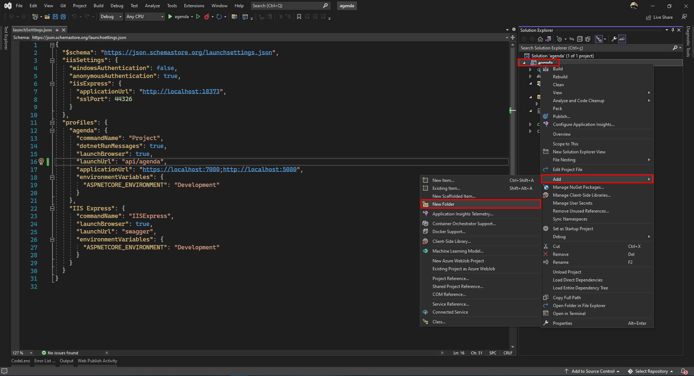
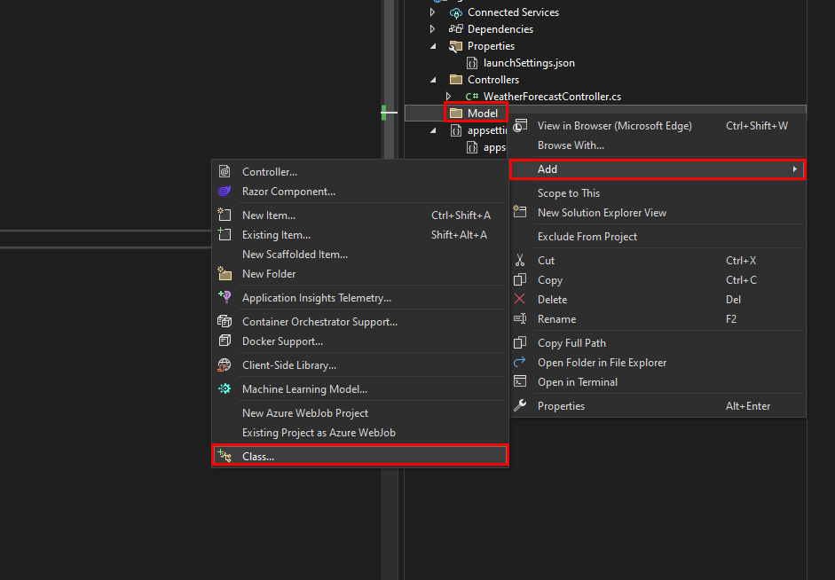
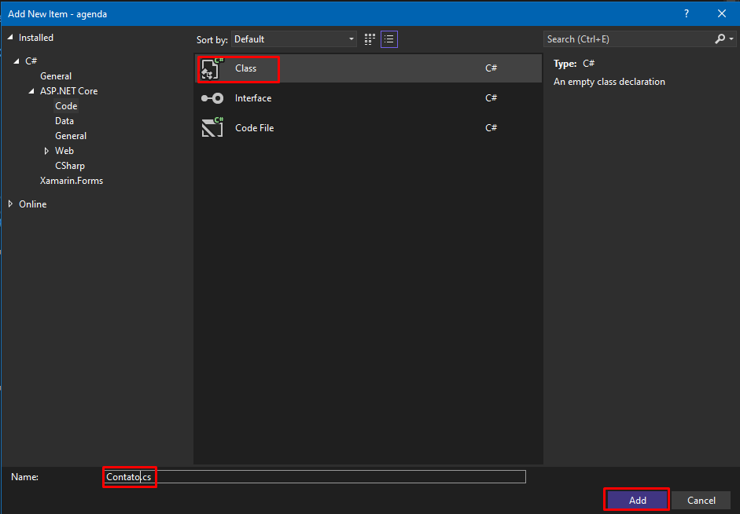
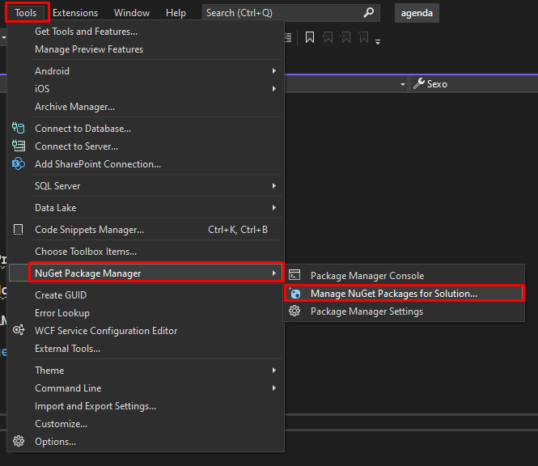
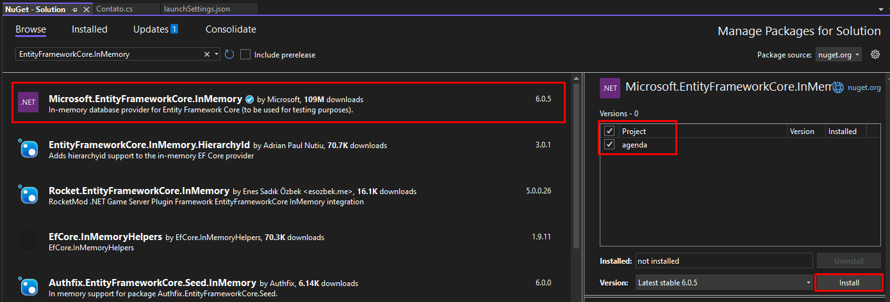

# Aula 29 - Introdução à Entity Framework

## Adicionando a Model

**Nota:** Um modelo é um conjunto de classes que representam os dados gerenciados pelo aplicativo. (Definição oficial Microsoft Docs).

Nesta etapa do projeto iremos adicionar uma classe de Modelo que será responsável por receber os dados e interagir com o controlador.

Em `Solution Explorer` (Gerenciador de Soluções), clique com o botão direito do mouse no projeto. Selecione Pasta Add New > Nomeie a pasta `Models`.

Clique com o botão direito do mouse na Models pasta e selecione `Add Class` > Dê à classe o nome Contato e selecione Adicionar.

Substitua todo o conteúdo da classe pelo abaixo:



<br>



<br>



<br>

```cs
namespace agenda.Models
{
    public class Contato
    {
        public int Id { get; set; }
        public string Nome { get; set; }
        public string EmailPrincipal { get; set; }
        public string Apelido { get; set; }
        public DateTime DataNascimento { get; set; }
        public char Sexo { get; set; }

    }
}
```

## Adicionando Entity Framework InMemory

**Nota:** O contexto de banco de dados é a classe principal que coordena a funcionalidade do Entity Framework para um modelo de dados. Essa classe é criada derivando-a da classe [Microsoft.EntityFrameworkCore.DbContext](https://docs.microsoft.com/pt-BR/dotnet/api/microsoft.entityframeworkcore.dbcontext?view=efcore-6.0). (Definição oficial por Microsoft Docs).

No menu **Ferramentas**, selecione **NuGet Gerenciador de Pacotes > Gerenciar pacotes de NuGet para solução**.

Selecione a guia **Procurar** e, em seguida, insira `Microsoft.EntityFrameworkCore.InMemory` na caixa de pesquisa.

Selecione `Microsoft.EntityFrameworkCore.InMemory` no painel esquerdo.

Selecione a caixa de seleção **Project** no painel direito e selecione **Instalar**.



<br>



<br>

## Adicionar o Contexto

Clique com o botão direito do mouse na Models pasta e selecione **Add Class** > Nomeie a classe como *AgendaContext* e clique em **Adicionar**.

Substitua o código pelo disponibilizado abaixo:

```cs
using Microsoft.EntityFrameworkCore;

namespace agenda.Models
{
    public class AgendaContext : DbContext
    {
        public AgendaContext(DbContextOptions<AgendaContext> options)
            : base(options)
        {
        }
        
        public DbSet<Contato> Contatos { get; set; }
    }
}
```

## Registrar o contexto na Injeção de Dependência

Nos aplicativos ASP.NET Core, os serviços de importância e que devem estar disponibilizados para todos os controladores precisam ser registrados no contêiner da Injeção de Dependência (DI). Que de forma automática ele estará disponível para os controladores.

- [ ] Abra o arquivo Program.cs e edite com o código abaixo:

```cs
using Microsoft.EntityFrameworkCore;
using agenda.Models;

var builder = WebApplication.CreateBuilder(args);

// Add services to the container.

builder.Services.AddControllers();
// Learn more about configuring Swagger/OpenAPI at https://aka.ms/aspnetcore/swashbuckle
builder.Services.AddDbContext<AgendaContext>(opt => opt.UseInMemoryDatabase("Agenda"));

var app = builder.Build();

// Configure the HTTP request pipeline.
if (app.Environment.IsDevelopment())
{
    app.UseDeveloperExceptionPage();
}

app.UseHttpsRedirection();

app.UseAuthorization();

app.MapControllers();

app.Run();
```